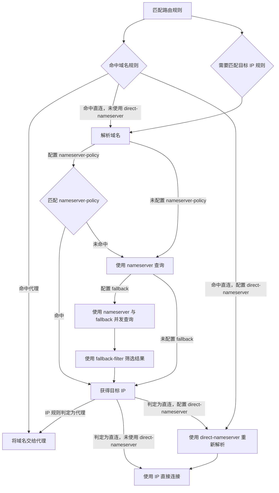

# Mihomo DNS 解析流程

本文总结 MetaCubeX 文档中 [DNS 解析流程](https://wiki.metacubex.one/config/dns/diagram/#_3) 的处理逻辑。内容只描述 Mihomo DNS 模块如何参与规则匹配、域名解析和连接建立，不展开 Fake-IP、DNS 劫持或代理节点域名解析等其他流程。

## 核心结论

Mihomo 不会无条件先解析域名。它会先匹配路由规则，再根据命中的规则类型和策略决定是否需要 DNS：

- 命中域名规则时，已经可以确定代理或直连意图；代理连接可直接把域名交给代理，直连连接则需要取得目标 IP。
- 命中目标 IP 规则前，必须先解析域名，之后才能用解析结果继续匹配 IP 规则。
- 需要常规解析时，`nameserver-policy` 优先决定特定域名使用哪个 DNS；未命中策略才使用 `nameserver`。
- 配置了 `fallback` 时，`nameserver` 与 `fallback` 并发查询，并由 `fallback-filter` 参与结果选择。
- 最终确定为直连且配置了 `direct-nameserver` 时，Mihomo 会用直连专用 DNS 重新解析，再使用得到的 IP 建立直连连接。

## 流程图



这张图按处理意图重新排版，与官方流程表达的是同一组判断关系；它不是 Mihomo 内部实现细节或严格的函数调用顺序。

## 分步说明

### 1. 先匹配路由规则

请求进入后，Mihomo 先尝试匹配规则。后续流程取决于决定路由所需的信息：

- **域名规则**可以直接使用原始域名判断，例如 `DOMAIN`、`DOMAIN-SUFFIX` 或域名类 `RULE-SET`。
- **目标 IP 规则**需要真实 IP 才能判断，例如 `IP-CIDR` 或 `GEOIP`，因此会先进入 DNS 解析流程。

### 2. 域名规则已经确定出口时

如果域名规则命中代理策略，Mihomo 可以把域名直接交给代理处理，不必为了本地直连而取得目标 IP。

如果域名规则命中直连策略，则必须获得 IP：

- 配置了 `direct-nameserver`：使用它解析，并用解析所得 IP 直连。
- 未配置 `direct-nameserver`：进入常规 DNS 解析流程，取得 IP 后直连。

### 3. 常规 DNS 如何选择上游

常规解析按以下优先关系选择 DNS：

1. 如果配置了 `nameserver-policy`，先尝试匹配域名策略。
2. 命中策略时，使用该策略指定的 DNS。
3. 未配置 `nameserver-policy`，或域名没有命中任何策略时，使用默认 `nameserver`。

因此，`nameserver-policy` 是针对特定域名覆盖默认解析器的入口，`nameserver` 是常规兜底。

### 4. `fallback` 与 `fallback-filter`

当默认 `nameserver` 路径配置了 `fallback` 时：

1. `nameserver` 和 `fallback` 并发查询。
2. `fallback-filter` 根据配置条件参与筛选解析结果。
3. 筛选完成后得到供后续 IP 规则判断或连接使用的目标 IP。

如果没有配置 `fallback`，则直接采用 `nameserver` 的查询结果。`nameserver-policy` 已命中的查询不会再回到这条默认 `nameserver` / `fallback` 路径。

官方示例中的筛选配置为：

```yaml
fallback-filter:
  geoip: true
  geoip-code: CN
  geosite:
    - gfw
  ipcidr:
    - 240.0.0.0/4
  domain:
    - '+.google.com'
    - '+.facebook.com'
    - '+.youtube.com'
```

- `geoip: true` + `geoip-code: CN`：默认 DNS 结果不属于 CN 时采用 fallback 结果。
- `geosite` / `domain`：查询域名命中指定分类或域名时采用 fallback 结果。
- `ipcidr`：默认 DNS 结果落入指定网段时采用 fallback；`240.0.0.0/4` 是保留地址空间，可用于识别明显异常的解析结果。

这些条件决定采用哪一侧的结果，不代表只向该侧发送查询；进入该分支后，`nameserver` 与 `fallback` 已经并发查询。

### 4.1 Sift 的混合实现

Sift Full/Core 保留高意图 `nameserver-policy`，只让未分类域名进入 fallback：

```yaml
nameserver-policy:
  # Sift 使用 rule-set selector
  "rule-set:proxy":
    - https://1.1.1.1/dns-query
    - https://8.8.8.8/dns-query
  "rule-set:cn,private":
    - https://223.5.5.5/dns-query
    - https://1.12.12.12/dns-query

nameserver:
  - https://223.5.5.5/dns-query
  - https://1.12.12.12/dns-query

fallback:
  - https://1.1.1.1/dns-query
  - https://8.8.8.8/dns-query

fallback-filter:
  geoip: true
  geoip-code: CN
  ipcidr:
    - 240.0.0.0/4
```

Sift 不在这里重复配置 `geosite:gfw` 或 Google/Facebook/YouTube 手写域名，因为它们已由 `rule-set:proxy` policy 提前交给海外 DoH。这样既保留明确域名的解析意图，也避免新增 GeoSite 数据库依赖。

为避免依赖客户端或 Mihomo 的隐式默认值，Full/Core 显式使用 MMDB 模式，将 `geox-url.mmdb` 固定到 MetaCubeX `geoip.metadb`，并每 24 小时自动更新。路由 CN IP 判断仍由 `cnip` provider 完成；该 MMDB 不替代路由规则集，也不再服务已移除的 `fallback-filter`。

### 5. 得到 IP 后再次决定代理或直连

当流程因 IP 类规则而发起解析时，取得 IP 后才能完成规则判断：

- IP 规则判定为代理：把原始域名交给代理。
- IP 规则判定为直连：使用目标 IP 直连。
- 判定为直连且配置了 `direct-nameserver`：先用 `direct-nameserver` 重新解析，再使用新的 IP 直连。

`direct-nameserver` 的作用不是替换所有 DNS，而是为最终确定的直连连接提供专用解析结果。

## 配置项职责速查

| 配置项 | 在流程中的职责 | 生效位置 |
| --- | --- | --- |
| `nameserver` | 默认 DNS 上游 | 常规解析且未命中 `nameserver-policy` 时 |
| `nameserver-policy` | 按域名指定 DNS 上游，优先于默认 `nameserver` | 常规解析开始时 |
| `fallback` | 与 `nameserver` 并发查询的备用 DNS | 进入默认 `nameserver` 路径且已配置时 |
| `fallback-filter` | 对并发查询结果进行条件筛选 | `nameserver` 与 `fallback` 返回结果后 |
| `direct-nameserver` | 为最终直连的连接重新解析域名 | 域名规则直接判定直连，或 IP 规则最终判定直连时 |

## 示例配置对应的路径

官方页面使用以下三条路由规则说明流程：

```yaml
rules:
  - DOMAIN-SUFFIX,google.com,PROXY
  - GEOIP,CN,DIRECT
  - MATCH,PROXY
```

- `www.google.com` 可直接命中域名代理规则，因此把域名交给 `PROXY`。
- 未命中域名规则、需要判断 `GEOIP,CN` 的域名，会先解析，再根据 IP 是否属于中国大陆决定 `DIRECT` 或继续命中 `MATCH,PROXY`。
- 如果最终命中 `DIRECT` 且配置了 `direct-nameserver`，会使用直连 DNS 重新解析后建立连接。

## UDP 与 TUN 的版本说明

官方页面注明：从 Mihomo `v1.19.10` 起，`direct-nameserver` 重新解析也适用于 UDP 连接；对于 TUN 入站，UDP 的这项行为仅在 Fake-IP 模式下生效。

## 阅读时容易混淆的点

- 路由规则决定“走代理还是直连”，DNS 配置决定“需要解析时向谁查询”；两者职责不同，但会在 IP 规则和 `direct-nameserver` 处相互影响。
- `nameserver-policy` 是常规解析器的按域名覆盖规则，不是路由策略组。
- `fallback` 不是简单的串行失败重试；官方流程明确表示它与 `nameserver` 并发查询。
- 代理路径在流程图中接收的是域名；目标域名最终如何解析，还取决于所选代理协议、代理端能力和其他相关配置，不属于这张 DNS 流程图的范围。

## 来源

- [MetaCubeX Wiki：DNS 解析流程](https://wiki.metacubex.one/config/dns/diagram/#_3)
- 页面标注的最后更新时间：2025-05-31
